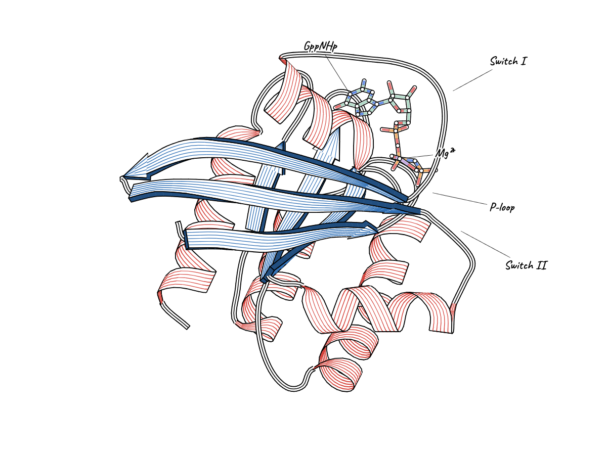
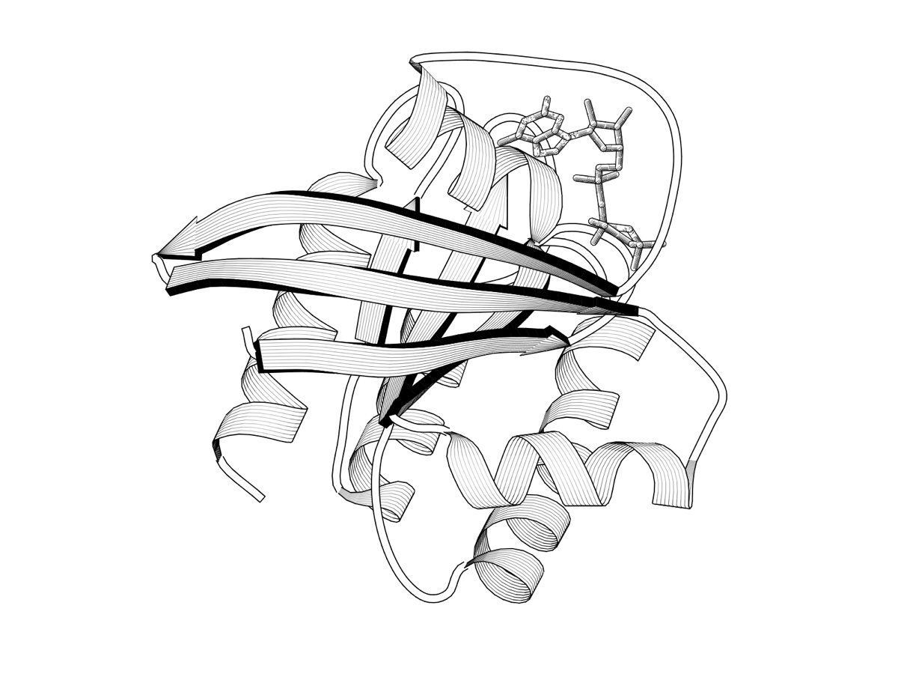
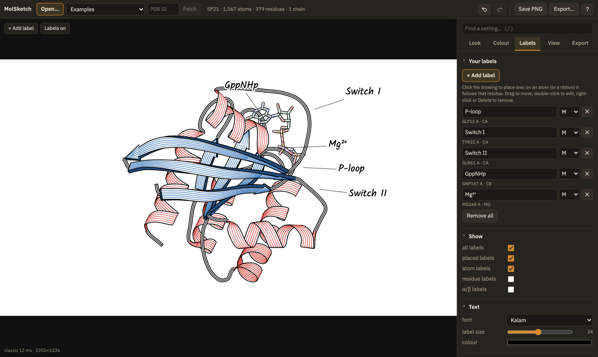
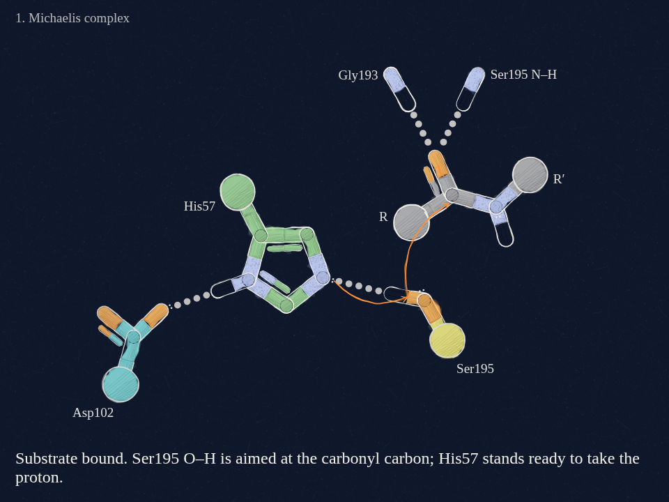
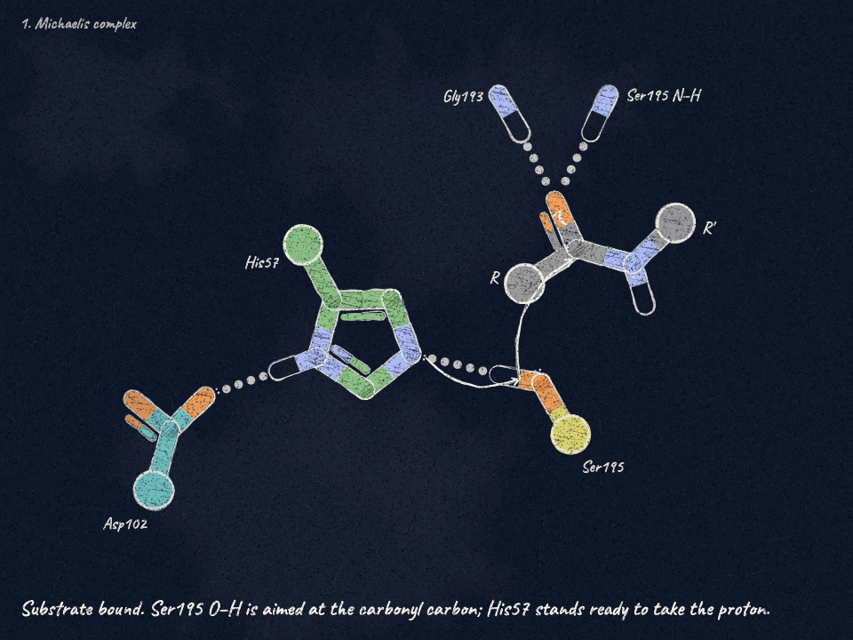
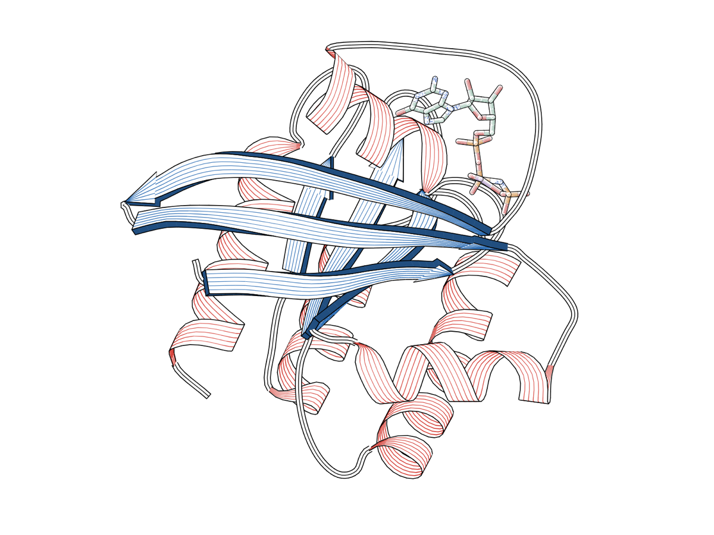
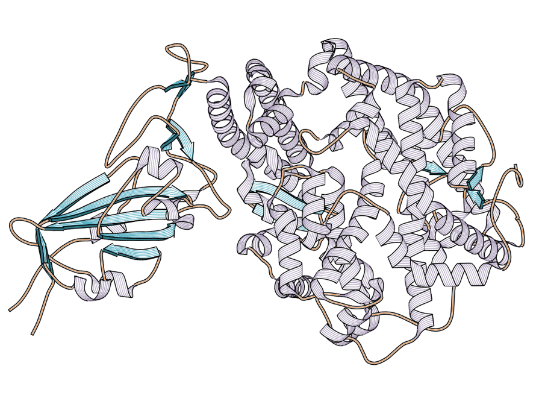
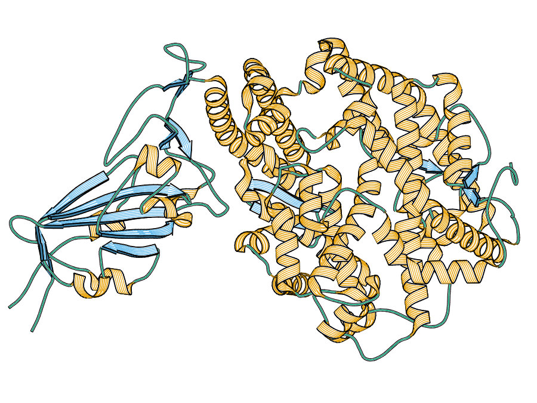
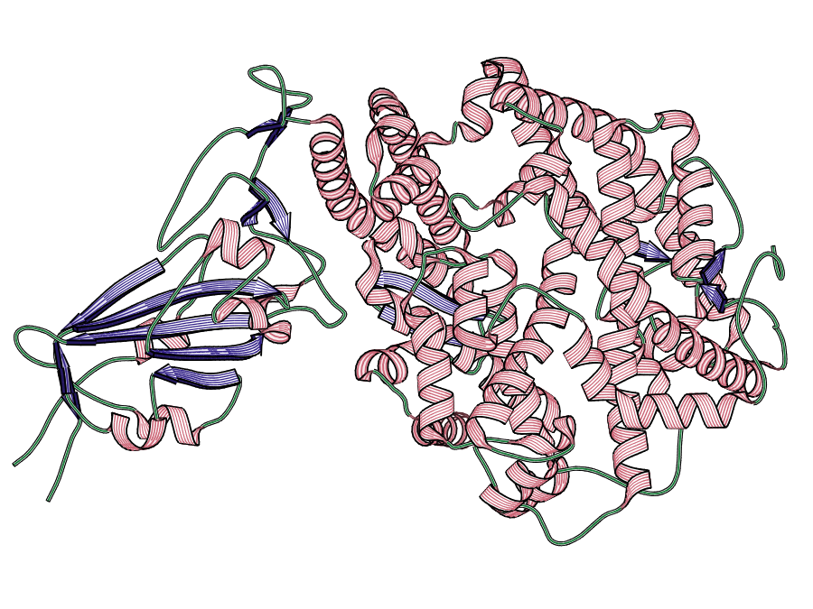

# MolSketch

Hand-drawn molecular illustration. MolSketch takes atomic coordinates (a PDB ID, a PDB or mmCIF file, or a keyframed
mechanism with curly arrows, charges and captions) and draws them the way an illustrator would: sticks and
ball-and-stick, cartoons and surfaces, in watercolour, pen and ink, coloured pencil, chalk, or the line-shaded ribbons
of MOLSCRIPT, on paper, with lines that boil from frame to frame so an animation looks drawn rather than rendered.



| Serine hydrolase mechanism, watercolour | Ras, engraved |
|---|---|
|  |  |
| **70S ribosome surface, by subunit** | **Pen and ink with coloured hatching** |
|  |  |

## Contents

- [Quick start](#quick-start)
- [Python](#python)
- [The app](#the-app)
- [Looks](#looks)
- [Engraved ribbons and palettes](#engraved-ribbons-and-palettes)
- [Labels](#labels)
- [Cryo-EM maps](#cryo-em-maps)
- [Mechanisms and animation](#mechanisms-and-animation)
- [The command line](#the-command-line)
- [Inputs and selections](#inputs-and-selections)
- [Repository layout](#repository-layout)
- [Reproducing the images](#reproducing-the-images)
- [Documentation](#documentation)

## Quick start

```bash
git clone git@github.com:jamaliki/mol-sketch.git && cd mol-sketch/app
npm install
npm run dev            # open http://localhost:5173
```

Type a PDB ID in the top bar (`5P21`, say) and press *Fetch*, pick a look, turn the molecule, and *Save PNG*. Drop a
PDB, mmCIF or scene JSON file on the drawing to open your own; drop several structure files to animate between them.

## Python

The same figures from Python, with no browser: the package runs the app's own drawing engine in an embedded V8 and
draws with Skia, so a figure made in Python matches the app to the pixel (see [python/README.md](python/README.md)).

```python
import molsketch as ms

fig = ms.fetch("2PTN").look("engraved-colour").site("resi 57+102+195").frame_site().label_site()
fig.save("trypsin.png", scale=2)
ms.load("mechanism.json").look("chalkboard").animate("loop.mp4")
```

`pip install ./python`, then `molsketch render …` from the terminal, or `molsketch serve` for the app itself with every
figure drawn by the package.

## The app



While you drag, a WebGL2 preview follows the mouse in a few milliseconds; when the view rests, the stroke engine
redraws the exact frame with real strokes, hatching and watercolour. Cost follows the visible outline rather than the
atom count, so a 144 000-atom ribosome settles in about a second.

- **Top bar**: *Open* (a file, a PDB ID, an EMDB map ID, the examples), undo / redo, `?` for every shortcut, and
  *Export*.
- **Layers** (left): what is in the picture, each part with a switch: the drawing style, the protein and its chains,
  side chains, ligands, water, the density map, the active site, labels, keyframes and the camera.
- **Inspector** (right): the settings of the selected layer, the everyday ones first and the fine tuning folded away:
  the looks drawn with your own molecule, how the protein is drawn and coloured, the map's contour and appearance,
  labels, the site, camera and light, and for a mechanism its keyframes, curly arrows, lone pairs, charges and checks.
- **On the drawing**: a dock to reset the view, spin, add a label and save the screen; a timeline for animations.
- **Export**: a PNG, poster or SVG at any size, the loop as a video (AV1, VP9 or H.264, encoded in the browser), the
  scene and style as JSON, and the command that renders exactly what is on screen from the terminal.

The search box (`/`) finds any setting in any layer. Every change can be undone, and the style is kept in the browser between
visits. The app's own [README](app/README.md) covers how the renderers fit together.

## Looks

**One grammar, several media.** Every look draws the same way and differs only in its medium. Ribbons are the engraved ones (MOLSCRIPT's geometry,
colour carried in lines along each face), and sticks follow them: next to engraved ribbons a side chain or ligand is
drawn with the same lines along each bond, so the whole figure reads as one drawing. A mechanism drawn only in sticks
keeps its hand-drawn sticks (*sticks style: auto*; set it to *engraved* or *sketch* to choose). All looks share one
pen (width 1.6, hierarchy 0.45; chalk keeps a broader stick, Assembly cartoon a thin one for huge complexes), and
what makes a look loose or crisp is its **hand**, one number from 0 (a ruled, engraved line) to 1 (a loose sketch)
that sets roughness, passes, pen pressure and fill wobble together: Engraved 0.08, Ink 0.55, Watercolour and Dark
paper 0.6, Chalkboard 0.72. The medium supplies the rest: ink leaves the faces paper, chalk leaves them board, and
watercolour lays a pale wash of the colour under darker lines.

The *hand* slider is at the top of *Look › Lines*.

A look sets everything at once; change anything afterwards. The app's *Looks* and the style files in [`looks/`](looks)
are the same set (the files are what *Export › Save style* writes, and *Load style*, `Figure.apply_style` and
`molsketch render --style` read them), described look by look in [docs/looks.md](docs/looks.md).

| look | | file |
|---|---|---|
| Watercolour | translucent washes on cream paper; the default for finished work | `looks/watercolour.json` |
| Ink colour | pen and ink with coloured hatching on white | `looks/ink-colour.json` |
| Ink | the same in black ink only | `looks/ink.json` |
| Pencil | coloured-pencil scribble fills with construction lines: any look with `fill="pencil"` | |
| Dark paper | pastel pigment on the lab website's navy, pale ink, no wash | `looks/dark-paper.json` |
| Chalkboard | chalk on the same navy: dusty fills, soft pitted lines | `looks/chalkboard.json` |
| Engraved | line-shaded ribbons, black on white, after MOLSCRIPT (Kraulis 1991) | `looks/engraved.json` |
| Engraved colour | the engraved ribbons with colour only in the lines | `looks/engraved-colour.json` |
| Assembly surface | watercolour surface coloured by subunit, for large complexes | `looks/assembly-surface.json` |
| Assembly cartoon | tubes and ribbons by subunit, thin pen, heavy fog | `looks/assembly-cartoon.json` |

| Pencil | Dark paper | Chalkboard |
|---|---|---|
|  |  |  |
| **Ink** | **Watercolour cartoon** | **Assembly cartoon** (70S ribosome) |
|  |  |  |

## Engraved ribbons and palettes

The engraved cartoon is a port of MOLSCRIPT's schematic geometry (helices along the local helix axis, smoothed strands
with stepped arrowheads, Priestle-smoothed coils) drawn the way its PostScript figures were: every face is paper with
lines running along it. As a face turns edge-on its lines thin out rather than fuse into a band, the colour they
carried stays as a pale tint, and the edges of a helix seen end-on take the ribbon's dark shade, so a helix pointing
at the viewer stays both coloured and legible. Where a helix turns over, its silhouette is inked.



In engraved colour, a group palette colours the ribbons too: helix, sheet and coil take the first colours of the
palette that stand out against the paper (contrast at least 2.2) and from each other (ΔE at least 25), in the
palette's own order. Palettes whose first three already work are used as they are; pale ones skip to their stronger
colours, and a colour is deepened toward the ink only when the palette runs out. There are 29 palettes, from the
colour-blind-safe sets (Okabe–Ito, Paul Tol, Tableau) to the studies in *jamaliki/design-corner*.

| Coastal Harvest | Okabe–Ito | Tol muted |
|---|---|---|
|  |  |  |

## Labels

Press *+ Add label* (or `L`) and click the drawing. On an atom or a ribbon the label is pinned to that residue, starts
as its name (`Gly12`), and turns with the molecule; anywhere else it stays where it is on the canvas. Type the text,
drag it off the atom (a leader runs back once it is far enough), double-click to edit, right-click or Delete to
remove. *Labels on / off* on the drawing hides every label at once, and the Labels tab chooses which kinds show: the
ones you placed, a scene's atom labels, residue labels, and α/β numbering on engraved ribbons (off by default).

Placed labels are part of the figure: they are saved in the scene JSON (`labels`, see
[docs/scene-format.md](docs/scene-format.md)) and drawn in every PNG, poster, video and CLI render.

## Cryo-EM maps

Density maps draw on their own, with the model built into them, or close up around a few residues, in ink by default
in every look. Maps come from EMDB (with the depositors' recommended contour level) or your own MRC / CCP4 files; the
contour is chosen in the map's units or in σ, and a caption states how the map is shown (its level, any low-pass or
carving). In the app, use the Map tab; in Python:

```python
ms.fetch("3J5P", map=True)           # an entry with the map it was built into
ms.fetch_map("EMD-5778")             # a map on its own
ms.fetch("7A4M", map=True).map(zone="resi 93", sigma=3)   # a residue in its density
```

```bash
molsketch render 3J5P --map auto -o trpv1.png
molsketch render EMD-5778 --look ink -o map.png
```

| | | |
|---|---|---|
|  |  |  |

How maps are drawn and why (low-passing whole particles, the level that encloses the molecule's mass, cropping to the
model, close-ups): [docs/maps.md](docs/maps.md).

## Mechanisms and animation

A scene is a list of keyframes, each with atoms, bonds, curly arrows, lone pairs, charges and a caption; MolSketch
interpolates between them, draws bonds forming and breaking, and times the arrows ahead of the atoms. The example
`examples/mechanism.json` is the serine hydrolase mechanism at the top of this page.

- [docs/mechanism-from-pdbs.md](docs/mechanism-from-pdbs.md): from your own coordinates to a mechanism figure: load a
  PDB stack as keyframes, cut the view down, add arrows, charges and captions by clicking, render.
- [docs/hero-workflow.md](docs/hero-workflow.md): from computed states to a looping video, as for the lab website's
  front page ([`hero/`](hero), [`tools/mech2scene.py`](tools/mech2scene.py)).
- [docs/scene-format.md](docs/scene-format.md): the scene JSON, field by field.

## The command line

The Python package's `molsketch` command draws any figure from the terminal, with the same engine as the app:

```bash
pip install ./python
molsketch render 5P21 --look engraved-colour --yaw 60 --pitch 20 --size 1600x1200 -o ras.png
molsketch render 5P21 --look engraved -o ras.svg                  # a vector drawing
molsketch render examples/mechanism.json --look watercolour -o mech.mp4
molsketch render 6GZQ --look assembly-surface --turntable 72 --size 1080x1080 -o turn.mp4
```

`--style` takes a style saved from the app, `--set path=value` changes one field (`palette.helix=#de9151`,
`line.width=2`), `--fit L,T,R,B` frames the drawing into a box of the canvas, and `molsketch render --help` lists the
rest. Every option is in [python/docs/api.md](python/docs/api.md#the-command-line). In the app, *Export › Command line*
copies the exact command for what is on screen.

The app has its own headless renderer, `app/cli/render.mjs`, which draws through Chrome. It is the reference the
Python package is tested against (`python/tests/test_parity.py`), not a tool you need.

## Inputs and selections

- **PDB and mmCIF**: coordinates, alternate location A, secondary structure from the file or assigned from Cα
  geometry, nucleic acids, and mmCIF entities (ribosome subunits S, L, T drive the *subunit* colouring). Several files
  or a multi-model file become keyframes, matched atom by atom.
- **Scene JSON**: keyframes with arrows, charges, lone pairs, captions, cameras and placed labels.

Each representation takes a selection in a PyMOL-like language:

```
all  none  polymer  hetatm  water  protein  nucleic  backbone  sidechain  hydro
resi 57+102+195   resi 190-200   resn SER+HIS   name CA+CB   chain A+B   elem C+N
ss H+E   subunit S+L   entity 1+3   and  or  not  ( … )
```

for example `hetatm and not water`, `chain A and resi 50-120`, `subunit L`.

## Repository layout

| path | what it is |
|---|---|
| [`app/`](app) | the interactive app (Vite + TypeScript, WebGL2); its drawing engine, `app/src/classic/engine.js`, is the only one |
| [`python/`](python) | the `molsketch` package: the same engine without a browser, the command line, and the server the app draws through |
| [`looks/`](looks) | the looks as style files |
| [`examples/`](examples) | a mechanism scene, test structures, a synthetic 12k-atom assembly |
| [`hero/`](hero) | the lab website's animated hero, scenes and render script |
| [`tools/`](tools) | `make_images.py`: every image in this README; `mech2scene.py`: a scene from computed reaction states |
| [`docs/`](docs) | the guides below, and the images in this README |

## Reproducing the images

Every image here except the app screenshot comes from one script, with the Python package:

```bash
pip install ./python
python tools/make_images.py                # everything; the ribosome takes a few minutes
python tools/make_images.py ras palettes   # or some of it: looks, ras, palettes, protein, ribosome, turntable, styles
```

It also writes the style files in `looks/`. Each group is a short function in
[`tools/make_images.py`](tools/make_images.py), so it doubles as a set of examples.

## Documentation

- [app/README.md](app/README.md): the app, its renderers and its CLI
- [docs/looks.md](docs/looks.md): every look, setting by setting, with the command that makes its image
- [docs/scene-format.md](docs/scene-format.md): the scene JSON
- [docs/maps.md](docs/maps.md): cryo-EM density maps, how they are drawn and why
- [docs/mechanism-from-pdbs.md](docs/mechanism-from-pdbs.md): a mechanism figure from your own structures
- [docs/hero-workflow.md](docs/hero-workflow.md): computed states to a looping video
- [python/README.md](python/README.md), [python/docs/api.md](python/docs/api.md) and
  [python/docs/style.md](python/docs/style.md): the Python package, its whole API, and every style field
- [docs/reference.md](docs/reference.md): what the engine reads from a structure, how the drawing works, performance,
  and known limitations

MolSketch was called Triad Sketch until September 2026; scripts that use `window.TriadSketch` still work.

MIT licence, © 2026 Kiarash Jamali.
