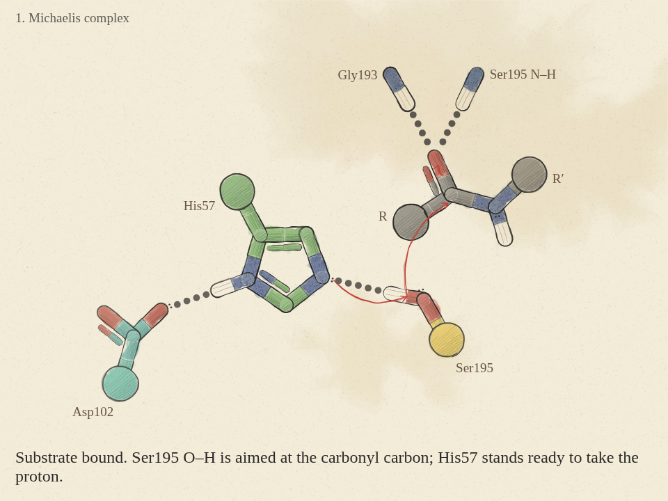
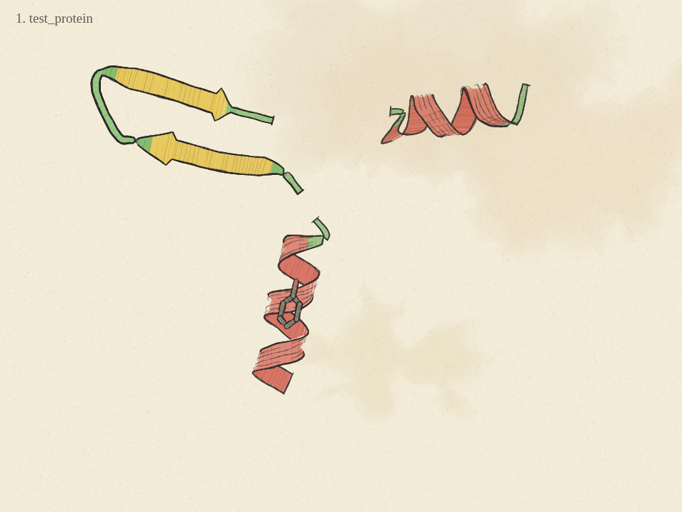
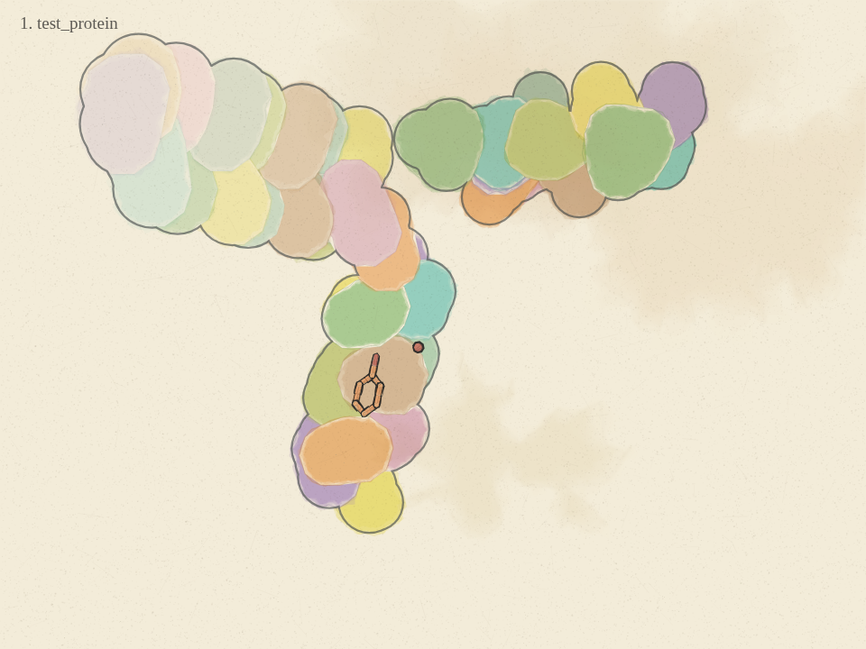
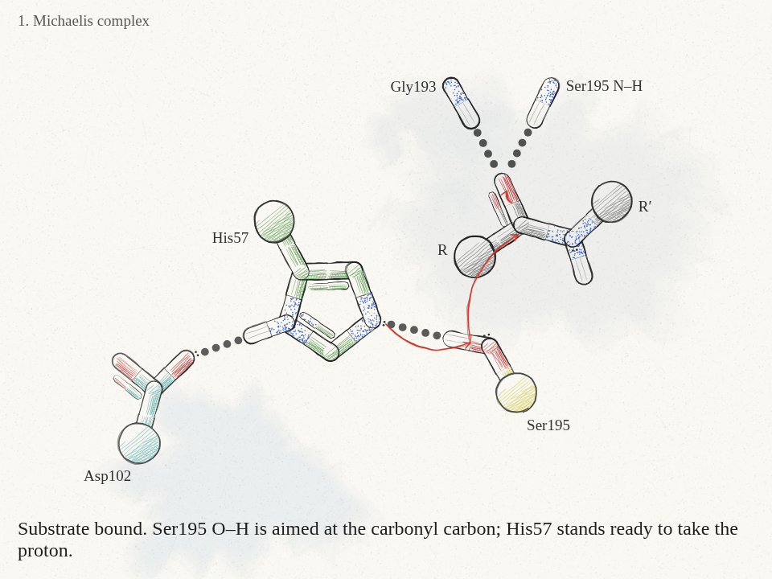
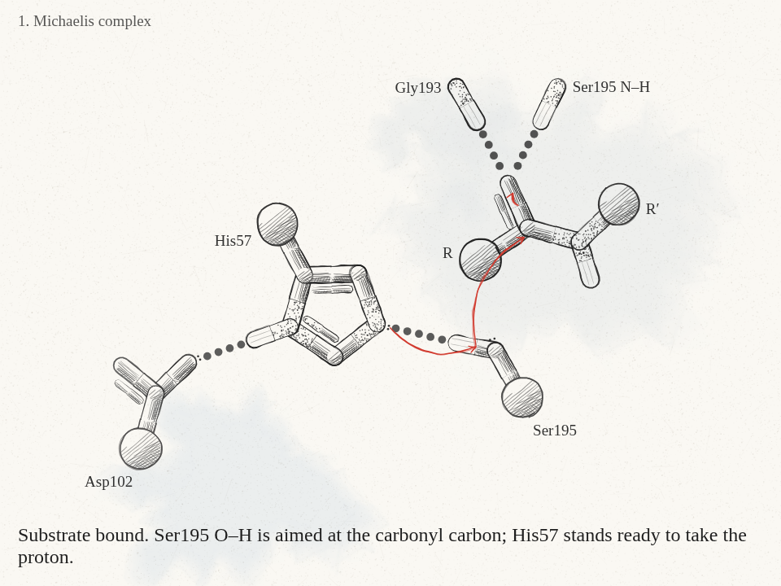
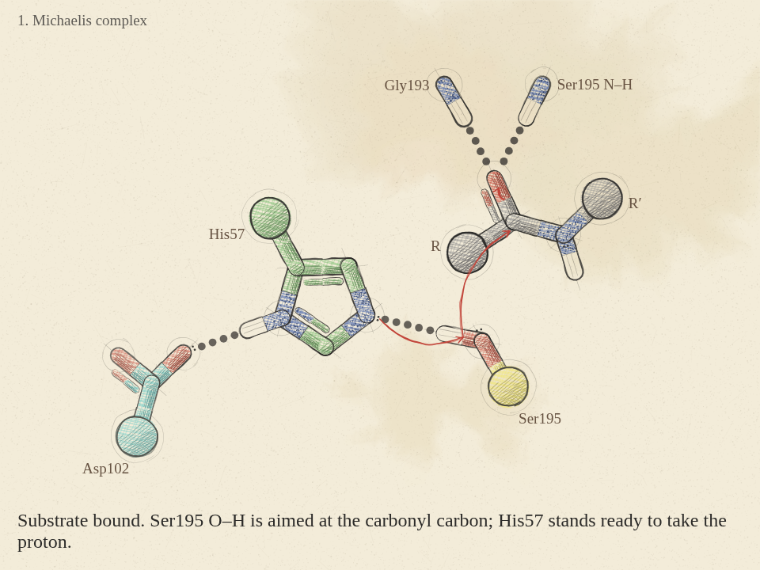
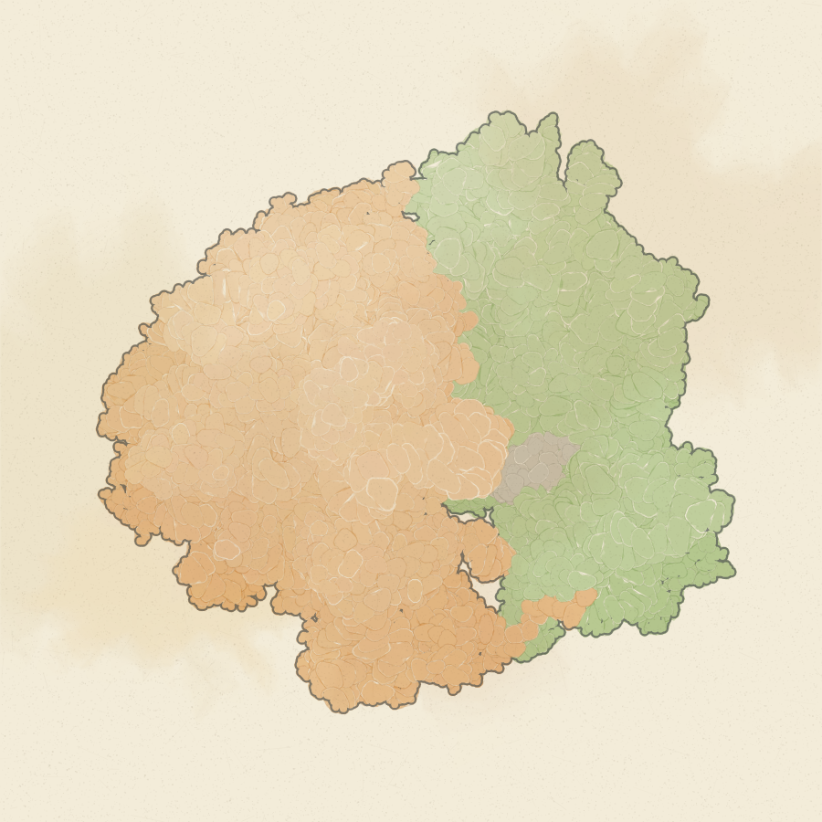
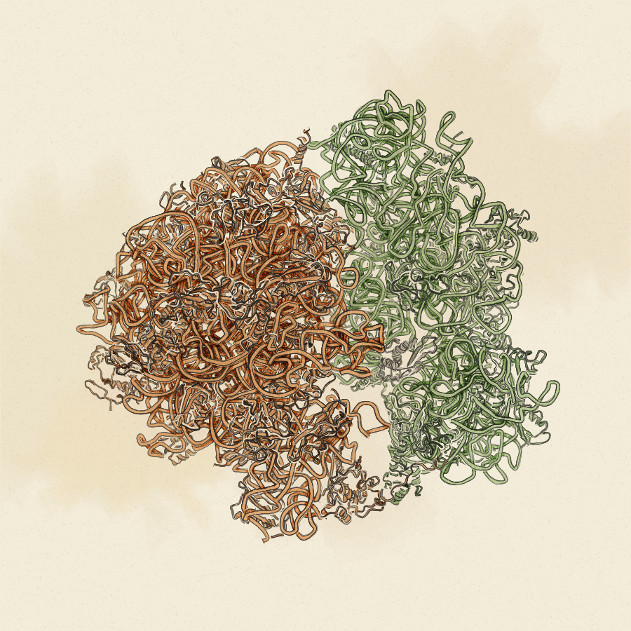
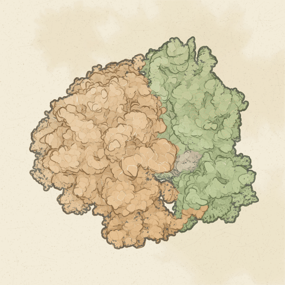

# Looks

Each file in `looks/` is a complete settings object, exactly what the page's *Data › Save settings* writes,
so a look can be loaded in the page (*Load settings*) or passed to the renderer with `--settings`. The files
do not carry a camera: a scene JSON brings its own `view`, and a PDB/mmCIF load orients the molecule by its
principal axes, so `view.*` is set per render with `--set`. The one exception is `assembly-cartoon.json`,
which sets only `view.fog` and `view.fogStart`.

Every image in `docs/img` is produced by `./make-previews.sh`, which runs the commands below verbatim. The
previews use `--scale 1` (960×720 px) to keep the repository small; for real output use `--scale 2` or `3`,
which only changes the pixel density, not the drawing.

How the files are applied: `--settings` merges each section (`rep`, `style`, `show`, `palette`, `view`)
over the defaults, then `--set` overrides run on top, in order. So a look plus a few `--set` flags is the
whole recipe; there is no hidden state.

The tables list only what each look changes from the defaults in the [settings reference](../README.md#settings-reference).

---

## 1. Watercolour — `looks/watercolour.json`



The default for finished work. Fills are stacked translucent layers with fractal edges, a darker drying ring
and granulation, multiplied over cream paper that has its own faint wash pools. The pools are alive: with every
drawing their edges creep a few pixels along slow noise tracks and their density rises and falls, as a wash does
while it dries, so an animation's background changes subtly from frame to frame instead of sitting still under
the moving strokes.

```bash
node render.js examples/mechanism.json --settings looks/watercolour.json --frames 28
```

Frame 28 is the end of the first hold (holds are 30 frames; curly arrows draw during the last 40 % of a
hold, so they are complete by 28). `--frames drawn` renders the whole animation, one file per drawing.

| setting | value | why |
|---|---|---|
| `rep.fill` | `watercolour` | the fill engine |
| `palette` | the *Colored pencil* preset | cream paper `#f3ecd9`, warm ink `#2b2a28`, muted element colours (C `#6b6660`, N `#3f5fa8`, O `#c94b3c`, S `#c9a227`), wash `#d1a35b` |
| `style.wash` | `0.3` (default) | strength of the paper's wash pools; 0 gives clean paper, 0.5 is noticeably stained |
| `style.washSeed` | `1` (default) | which pool layout; change it if a pool sits under something important |
| `style.washLife` | `0.6` (default) | how much the pools creep and their density breathes from drawing to drawing; 0 freezes them |

Residue colours in this image come from the scene (`groupColors` in `examples/mechanism.json`: Ser195
yellow, His57 green, Asp102 teal). With a PDB and no scene overrides, carbons follow `rep.colorBy`.

The same look on a structure, cartoon plus ligand sticks, then as a surface coloured by residue:

| | |
|---|---|
|  |  |

```bash
node render.js examples/test_protein.pdb --settings looks/watercolour.json \
     --set view.yaw=30 --set view.pitch=20 --frames 0

node render.js examples/test_protein.pdb --settings looks/watercolour.json \
     --set view.yaw=30 --set view.pitch=20 \
     --set reps.cartoon= --set reps.surface=polymer --set reps.sticks=hetatm \
     --set rep.surfaceColor=carbon --set rep.colorBy=residue --frames 0
```

`reps.*` are scene selections (what to draw), `rep.*` are settings (how to draw it). A PDB load defaults to
`cartoon=polymer`, `sticks=hetatm and not water`, `surface=` (off); the second command turns the cartoon off
and the surface on, and colours the surface patches per residue through the automatic residue palette
(no blues or reds, so they never read as N or O).

## 2. Ink colour — `looks/ink-colour.json`



Pen and ink with a hint of colour: no fills, the paper shows through everything; nitrogen is stippled,
oxygen hatched, sulfur cross-hatched, carbon gets a sparse hatch in its residue colour; a tick marks each
bond midpoint. This is the look closest to the pen-drawn reference the project started from.

```bash
node render.js examples/mechanism.json --settings looks/ink-colour.json --frames 28
```

| setting | value | why |
|---|---|---|
| `rep.fill` | `ink colour` | hatching takes the element / residue colour |
| `palette` | the *PyMOL flat* preset (default) | white paper `#faf8f3`, near-black ink, PyMOL element colours; the wash is a cool blue-grey `#7fb2c9` on white paper |
| `style.washSeed` | `6` | a pool layout that keeps the big pool away from the histidine ring on this scene |

Knobs worth knowing: `style.hatchSpacing` (5 px) and `style.hatchDensity` (1.4) set how dense the
hatching is; `style.inkWidth` (1.5) the outline weight; `style.hierarchy` (0.6) how much lighter interior
marks are than silhouettes; `style.passes` (2) how many times each line is overdrawn.

## 3. Ink — `looks/ink.json`



Same as ink colour, in black ink only. Everything else identical, so the two can be swapped without
retuning.

```bash
node render.js examples/mechanism.json --settings looks/ink.json --frames 28
```

| setting | value |
|---|---|
| `rep.fill` | `ink` |
| `style.washSeed` | `6` |

For pure line art with no paper wash at all add `--set style.wash=0 --set style.grain=0`.

## 4. Pencil — `looks/pencil.json`



Coloured-pencil scribble fills that stray past the outline, three outline passes, and construction lines
(the faint circles and guide strokes an illustrator leaves in). Reads best on the cream paper.

```bash
node render.js examples/mechanism.json --settings looks/pencil.json --frames 28
```

| setting | value | why |
|---|---|---|
| `rep.fill` | `pencil` | scribble fills |
| `palette` | the *Colored pencil* preset | as in the watercolour look |
| `show.construction` | `true` | construction lines; they suit pencil and look wrong in ink |

`style.pencilFill` (0.55) is the scribble density and `style.fillWobble` (1) how far the fill strays
from the line.

## 5. Assembly surface by subunit — `looks/assembly-surface.json`



A whole complex as a watercolour surface, one colour per subunit: small subunit green, large subunit
orange, tRNA rose, everything else grey. Patches are painted back to front with a depth and light tone, so
the shape reads without outlines.

```bash
node render.js 6GZQ.cif --settings looks/assembly-surface.json \
     --set reps.cartoon= --set reps.sticks= --set reps.surface=polymer \
     --size 900x900 --frames 0
```

`6GZQ.cif` (a 70S ribosome, 144 138 atoms, mmCIF) is not in the repository; `make-previews.sh` downloads
it from `https://files.rcsb.org/download/6GZQ.cif`. Expect roughly 7 s per frame at this size.

| setting | value | why |
|---|---|---|
| `rep.fill` | `watercolour` | |
| `palette` | the *Colored pencil* preset | |
| `rep.surfaceColor` | `subunit` | S/L/T/X classification from the mmCIF entity descriptions (`_entity.pdbx_description`: 30S/16S/18S/40S/"small" → S, 50S/23S/28S/25S/5.8S/5S/60S/"large" → L, tRNA/mRNA → T, anything else X); a plain PDB has no entity descriptions, so everything is X |
| `show.stepLabel`, `show.caption` | `false` | no "1. 6gzq" in the corner |

Subunit colours are `palette`-independent constants (`SUBUNIT_COLS`); override them from the scene with
`--set groupColors.subunit:S=#9cc27a --set groupColors.subunit:L=#e6a45a --set groupColors.subunit:T=#c96d8a`.
For one colour per chain use `--set rep.surfaceColor=chain`; for a single colour,
`--set rep.surfaceColor=single --set palette.surface=#cfd8e0`.

`rep.probe` (1.4 Å) and `rep.surfaceScale` (1) change how bulbous the surface is; `view.fog` (0.5) and
`view.fogStart` (0.45) how much the far side fades into the paper.

## 6. Assembly cartoon by subunit — `looks/assembly-cartoon.json`



The same complex as tubes (RNA, traced along P atoms) and ribbons (protein), coloured by subunit rather
than secondary structure, with a thinner pen and heavier fog so the tangle stays legible.

```bash
node render.js 6GZQ.cif --settings looks/assembly-cartoon.json \
     --set reps.cartoon=polymer --set reps.sticks= --set reps.surface= \
     --size 900x900 --frames 0
```

| setting | value | why |
|---|---|---|
| `rep.fill` | `watercolour` | |
| `palette` | the *Colored pencil* preset | |
| `rep.cartoonColor` | `carbon` | colour the cartoon by the carbon scheme instead of helix/sheet/loop |
| `rep.colorBy` | `subunit` | the carbon scheme |
| `style.inkWidth` | `0.5` | thin outlines; at the default 1.5 the dense RNA core reads as a black mass |
| `view.fog`, `view.fogStart` | `0.7`, `0.3` | strong depth fade; this is the only look that carries `view` keys |
| `show.stepLabel`, `show.caption` | `false` | |

Secondary structure comes from `_struct_conf` / `_struct_sheet_range` when the file has them, otherwise
from a P-SEA-style geometric assignment on the Cα trace. `rep.cartoonScale` (1) is the ribbon width.

## 7. Turntable



`--turntable N` renders N frames of one full yaw rotation (it sets `view.spin` to `360·fps/N`). While
spinning, the fit uses the molecule's bounding sphere, so it does not breathe as it turns.
`view.pitchSwing` adds a pitch nod of that many degrees over the turn.

```bash
node render.js 6GZQ.cif --settings looks/assembly-surface.json \
     --set reps.cartoon= --set reps.sticks= --set reps.surface=polymer \
     --set view.pitchSwing=12 --size 720x720 --turntable 36 --out turn
ffmpeg -framerate 12 -pattern_type glob -i 'turn/frame_*.png' -c:v libx264 -pix_fmt yuv420p -crf 18 turntable.mp4
```

36 frames at 12 fps is a 3-second loop; 72 or 144 frames give a slower, smoother turn (the surface costs
about 7 s a frame at 720 px, so 144 frames is a quarter of an hour). The lines and wash still boil every
`boilEvery` frames during the turn; set `--set boilEvery=1` for a boil on every frame, or a large value to
hold one drawing.

---

## Making your own look

Open `triad-sketch.html`, set things up in the right-hand panel, *Data › Save settings*, and drop the file
in `looks/`. Delete its `view` block unless you want the camera baked in. Then:

```bash
node render.js scene.json --settings looks/mine.json --frames drawn --out out
```

To see what a look changes from the defaults, diff it against a fresh save from a page opened with
*Reset settings*, or read the defaults in the settings reference.
