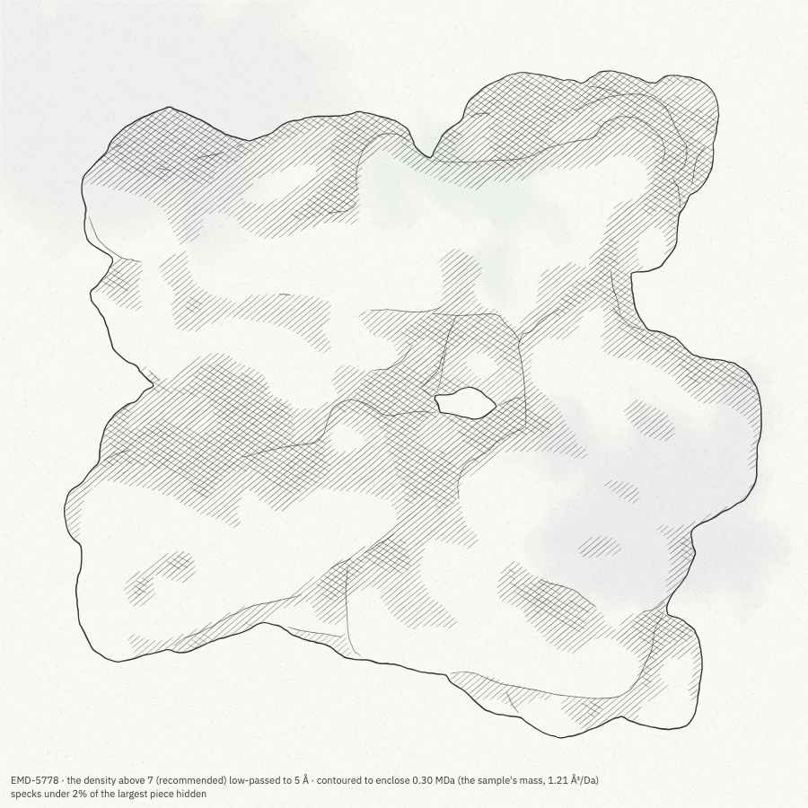
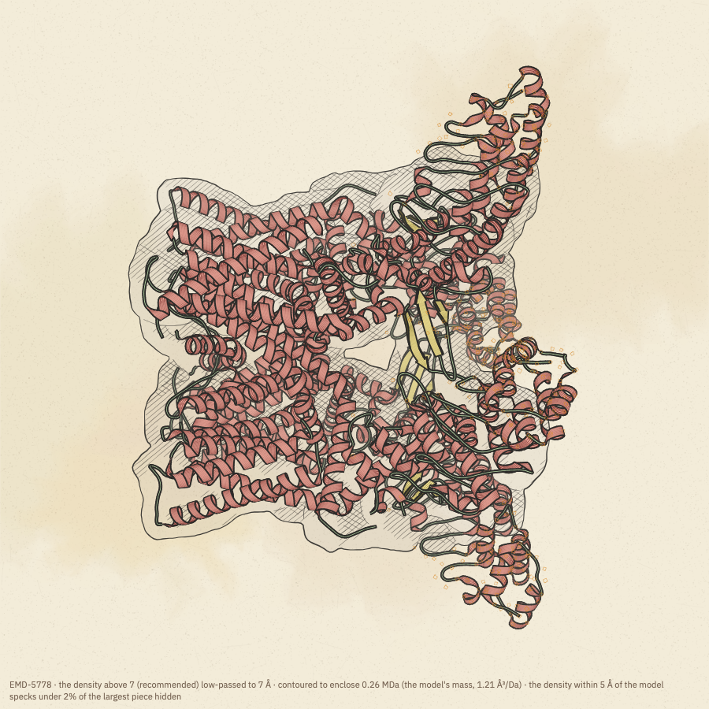
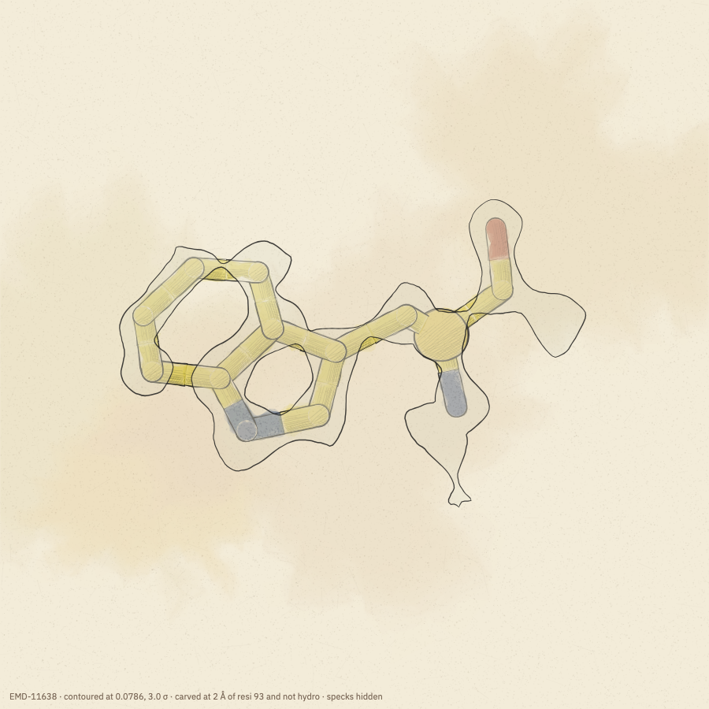
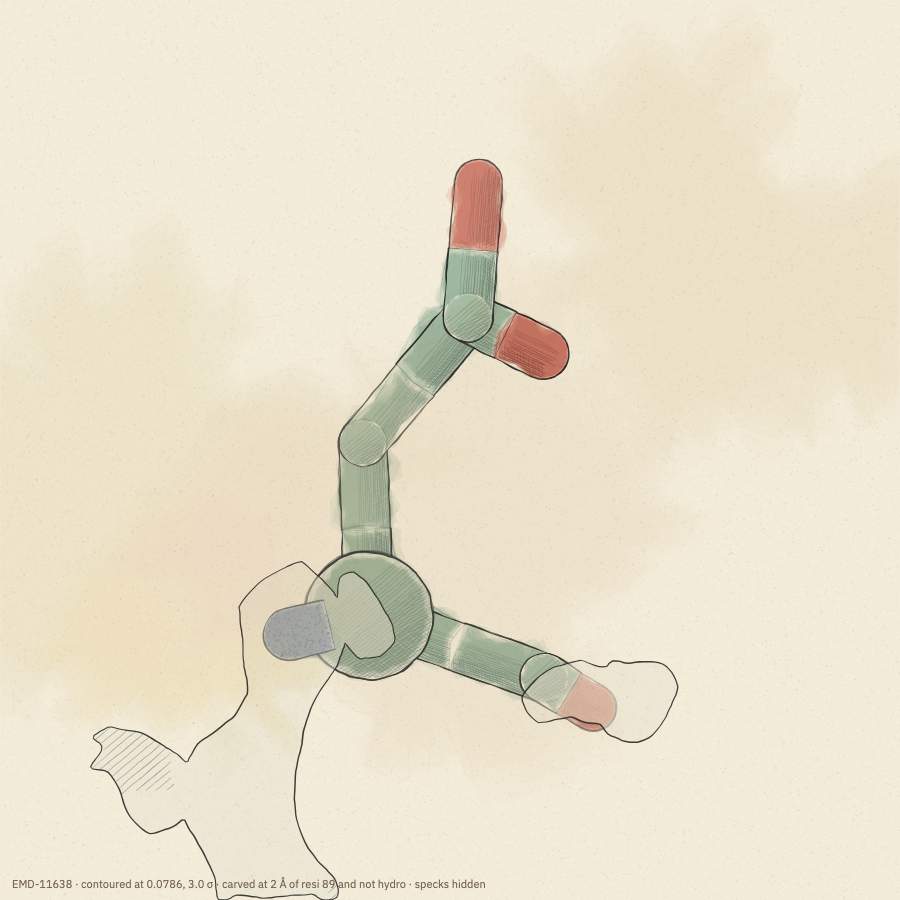

# Cryo-EM maps

MolSketch draws cryo-EM density maps on their own, with the model built into them, or close up around a few
residues. This page covers how to draw them and why they are drawn the way they are. Every choice that changes what a
map appears to show is written in the caption under the drawing.

| | |
|---|---|
|  |  |
| TRPV1 (EMD-5778) on its own | with its model (PDB 3J5P) |
|  |  |
| Trp93 of apoferritin in its density, 3 σ | Asp89 at 3 σ: the backbone is in density, the carboxylate is not |

## Getting a map

In Python:

```python
import molsketch as ms

fig = ms.fetch_map("EMD-5778")             # a map on its own, from EMDB
fig = ms.fetch("3J5P", map=True)           # a PDB entry with the map it was built into
fig = ms.load("model.cif").map("my_map.mrc")   # your own model and map
fig = ms.load_map("my_map.mrc.gz")         # your own map on its own
```

In the app, open the **Map** tab: type an EMDB ID and press *Fetch*, press *Map of this entry* after fetching a PDB
entry, or open a map file (`.map`, `.mrc`, `.ccp4`, gzipped or not). You can also drop a map file on the drawing.

Maps from EMDB come with the depositors' recommended contour level and the sample's molecular mass, and are
downloaded once (Python keeps them in `~/.cache/molsketch/emdb`, the app in the browser's cache). Maps larger than
320 voxels a side are averaged down when they are read.

## The contour level

A map is drawn as the surface where the density equals the **contour level**. By default this is the level the
depositors recommended to EMDB. Choose another in the map's own units or in standard deviations (σ) above the mean:

```python
fig.map(level=0.09)      # the map's units
fig.map(sigma=3)         # mean + 3 σ
fig.map_info             # the level in use, the recommended one, the map's mean and σ, and more
```

Setting one clears the other. A map without a recommended level (a file of your own) starts at the level enclosing
0.7% of its box, which is what EMDB's recommended levels typically enclose; a recommended level that encloses more
than 40% of the box (it happens with tomographic averages) is set aside the same way, and the caption says so. In the app, use the *σ above mean* slider or type a level; *Recommended* goes back to
the depositors' level.

The level matters most in close-ups. The two images of Trp93 above differ only in their level: at the recommended
level (4.4 σ, for this 1.2 Å map) the density breaks into blobs around individual atoms; at 3 σ it is one continuous
envelope around the ring.

`map_info["atomInclusion"]` is the share of the model's heavy atoms inside the contour, the fit measure EMDB
reports. The app shows it in the Map tab.

## A whole particle: low-passed to what the picture can show

A drawing of a whole particle cannot show atoms, and a map drawn at atomic detail at that scale is a mass of specks.
So for a whole particle (on its own, or a model with its map) the map is **low-passed** (smoothed) to about a
twentieth of what is drawn, 4 Å at the finest, and contoured to enclose the molecule's volume:

1. What is smoothed is the density above the contour level, with the rest set to zero. Maps are usually sharpened
   before deposition, which removes their low frequencies: the protein's average density is then the same as the
   solvent's, and smoothing the whole map would leave only noise. Keeping the density above the recommended level
   keeps the depositors' choice of what is signal.
2. The smoothed map is contoured at the level that encloses the molecule's volume: its mass × 1.21 ų per dalton
   (the average density of protein). The mass is the model's, or, for a map on its own, the sample's as deposited in
   EMDB. Without either, the contour is 2 σ of the smoothed map.
3. Pieces of surface under 2% of the largest are hidden: they are what smoothing noise leaves.

The caption says all three, for example *"EMD-5778 · the density above 7 (recommended) low-passed to 5 Å ·
contoured to enclose 0.30 MDa (the sample's mass, 1.21 ų/Da) · specks under 2% of the largest piece hidden"*.

`fig.map(smooth=0)` draws the map unfiltered at the plain contour level; `smooth=6` low-passes to 6 Å.

## A map with its model

For a whole model, the map is drawn **behind** it: the model is painted over it and keeps its colour, and the map shows around
it and through its gaps. `layer="over"` draws the map over the model instead, as a translucent envelope (`opacity`,
0.55 by default), and `layer="lines"` draws only the map's outline over the model. In the app: Map › Drawing › *with
the model*. Two more choices keep the picture about this model:

- **Cropping.** The map is cropped to the model's box plus 8 Å (`crop`).
- **Density near the model.** When the map is low-passed, only the density within 5 Å of the model is kept, before
  smoothing, so the surface closes smoothly around the model. A model of one chain in a map of a whole assembly
  (such as apoferritin's 24 copies) then does not disappear inside its neighbours. The caption says *"the density
  within 5 Å of the model"*. `context="show"` keeps the rest of the assembly, drawn faintly.

Two marks tell you how well the model and map agree:

- **Unsupported residues** get a small circle in the accent colour: residues most of whose atoms lie below half
  the contour level (`unsupported`, on by default). In TRPV1 they fall on the ankyrin repeats, which are poorly
  resolved in this map.
- **Unexplained density** is density the model does not account for, such as a ligand or a missing loop, drawn in
  the accent colour (`unexplained`, off by default). With it on, a low-passed map keeps the density within 10 Å of the
  model (not 5), so there is something beyond the model to see, and density counts as unexplained when it lies further
  from every atom than three quarters of the low-pass resolution.

## A close look at residues

To see how residues sit in their density, give the map a **zone** (a selection):

```python
fig = ms.fetch("7A4M", map=True).map(zone="resi 93", sigma=3)
```

The zone's residues are drawn as sticks, the drawing is framed on them and their density, and, unless an active site
is set, they are treated as one: the ribbons in front of them fade and the rest of the model is quieter. To leave the
rest of the model out, show only the residues:

```python
sel = "resi 93 and not hydro"
fig = ms.fetch("7A4M", map=True).map(zone=sel, carve=2, sigma=3).show(sticks=sel, cartoon=None)
```

- `zone` keeps the map around the selection at its full resolution (it is never low-passed) and draws it over the
  sticks, as a translucent envelope, so the atoms are seen in their density (`layer="behind"` puts it back behind
  them). Only these residues get the unsupported mark.
- Without carving, the zone shows the density joined to the selection, up to 5 Å from its atoms: what the model
  explains, and any density it does not explain that touches it (a ligand, a missing side chain), but not the
  islands of the neighbours' density around it.
- `carve=2` keeps only the density within 2 Å of the selection's atoms. This makes the picture cleanest, but it hides
  density the model does not explain nearby, so it is off unless you ask, and the caption says when it is on.
- Residue numbers are the author numbers in the file, not the sequential label numbers.

Acidic side chains (Asp, Glu) often have little density in cryo-EM maps, because radiation damage removes their
carboxylates first. Asp89 above is an example: its backbone lies in density, its side chain does not.

## How the map is drawn

By default a map is drawn in **ink** whatever the look: a steady outline, hatching where the surface turns from the
light (only the deepest shadow when the map is drawn over a model), and the look's paper, with a faint wash on watercolour paper.
The surface is smoothed first (sampled finely for close-ups and Taubin-smoothed, as ChimeraX smooths surfaces), so it
has no grid facets.

| field | choices | |
|---|---|---|
| `marks` | `ink` (default), `look` | `look` uses the look's own marks, such as a watercolour gradient |
| `finish` | `drawn` (default), `smooth`, `sketch` | `smooth`: plainly lit, ChimeraX-like · `sketch`: the raw grid, hand-drawn |
| `style` | `surface` (default), `layers`, `mesh`, `slice` | `layers`: several contours nested (`levels`, as multiples of the level) · `mesh`: Coot-style chicken wire · `slice`: a section through the map, stippled by density |
| `layer` | `auto` (behind a model), `over`, `lines` | where the map is drawn relative to the model |
| `shade`, `line_width`, `line` | | how much shading, how heavy the outline, and its colour (default: the look's ink) |

The full list of map fields is in [python/docs/style.md](../python/docs/style.md#density-maps).
