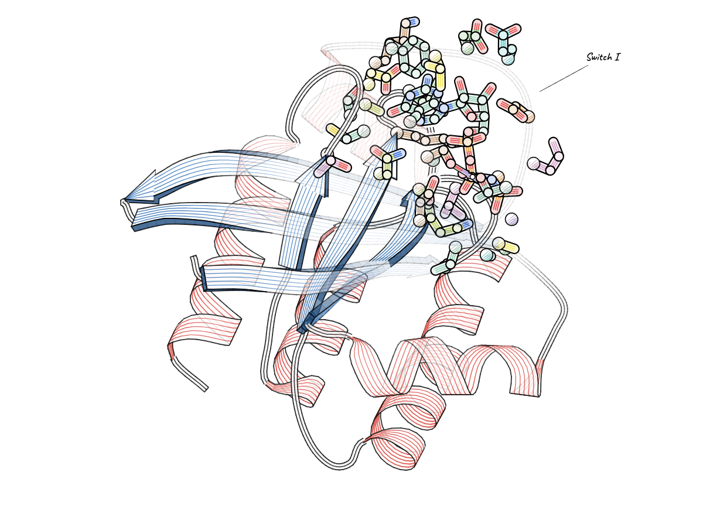

# molsketch

Hand-drawn molecular figures from Python: engraved ribbons after MOLSCRIPT, watercolour, chalk, pen and ink.
It is the [MolSketch](https://github.com/jamaliki/mol-sketch) app's own drawing engine, run without a browser, so a
figure made here and the same figure in the app are the same picture.

```python
import molsketch as ms

fig = ms.fetch("5P21").look("engraved-colour").view(yaw=60, pitch=20)
fig.site(ligand=True)                                   # the pocket round GppNHp, in bold over its protein
fig.label("Switch I", at="Tyr32", offset=(110, -60))
fig.save("ras.png")                                     # 1920 × 1440; size=(w, h), scale=2 for print
```



In a notebook, a figure shows itself. Every method returns the figure, so calls chain.

**Documentation:** [API reference](docs/api.md) (every function and argument) · [Style fields](docs/style.md)
(everything `set` can change) · [Examples](examples/) (scripts, with the pictures they make).

## Install

```bash
pip install ./python            # from a clone of the repository (Python 3.10+)
```

For `molsketch serve`, bundle the app into the package first: `cd app && npm install && node scripts/build-python.mjs`.

No browser, Node or GPU: the engine runs in an embedded V8 (mini-racer) and draws with Skia, the rasteriser behind
Chrome's canvas. The fonts the app uses ship with the package.

## Figures

```python
ms.load("protein.cif")                  # a PDB or mmCIF file
ms.load("mechanism.json")               # a scene saved from the app (keyframes, arrows, labels, site)
ms.load(["s1.pdb", "s2.pdb", "s3.pdb"]) # several structures: one keyframe each, animated between
ms.load(text, name="model")             # PDB / mmCIF text, or a Biopython, gemmi or MDAnalysis structure
ms.fetch("2PTN")                        # an entry from the PDB (cached in ~/.cache/molsketch)
```

| method | what it does |
|---|---|
| `.look(name)` | start from a look: watercolour, ink-colour, ink, dark-paper, chalkboard, engraved, engraved-colour, assembly-surface, assembly-cartoon (`ms.looks()` describes them) |
| `.show(sticks=, cartoon=, surface=)` | what to draw, as [selections](docs/api.md#selections): `"hetatm and not water"`, `"chain A and resi 50-120"`; `None` for nothing |
| `.view(yaw=, pitch=, roll=, zoom=, pan=, fov=)` | turn and frame the molecule (angles in degrees; zoom 1 fits what is drawn; fov 0 is a flat projection) |
| `.palette(name)` | a group palette (`ms.palettes()`); with engraved ribbons it colours helix, sheet and coil too |
| `.color(group, colour)` | your own colour for a residue (`"SER195"`), a chain (`"A"`), a subunit (`"subunit:L"`) or an entity (`"entity:1"`) |
| `.set(**fields)` | any [style field](docs/style.md), nested or dotted: `set(line={"width": 2}, **{"hatch.spacing": 4})` |
| `.apply_style(path)` | a whole style saved from the app (Export › Save style) |
| `.site(selection)` · `.site(ligand=True, within=5)` | mark the active site: bold sticks on a paper halo, the ribbon in front cut away (`cutaway=`), the rest faded (`quiet=`) |
| `.frame_site(size)` · `.label_site(size)` | turn the site towards you and zoom in; label its residues (give the size you save at) |
| `.label(text, at="Tyr32", offset=(dx, dy), size=1)` | a label pinned to an atom (`"Tyr32:OH"`, `"TYR32.A:CA"`), or placed on the canvas with `xy=(x, y)` |
| `.labels(False)` · `.labels(secondary=True)` · `.clear_labels()` | hide every label; switch one kind (placed, atoms, residues, α/β); remove the placed ones |
| `.frame(n)` | a scene's frame (24 per second), or for a structure, another version of the hand-drawn wobble |
| `.copy()` | an independent copy, for variations of one figure |
| `.style` · `.camera` | the style and camera the figure will be drawn with |

## Output

```python
fig.save("fig.png", size=(1600, 1200), scale=2)       # .png .jpg .webp; .json saves the scene for the app
img = fig.render((800, 600))                            # an Image (below)
fig.frames("drawn")                                     # a scene's frame numbers: "drawn", "all", "keyframes", 90, "10-40"
fig.save_frames("out/", "drawn")                        # frame_0000.png …
fig.animate("loop.mp4", fps=12)                         # a scene as a video (.mp4 .webm .gif, needs ffmpeg)
fig.turntable("spin.mp4", n=72, swing=10)               # one turn of a structure, nodding by 10°
fig.scene()                                             # the figure as the app's scene JSON
```

`size` is in pixels (1920 × 1440 by default). `scale=2` keeps the layout and doubles the detail, for print.

An `Image` has `width`, `height` and `size`, and:

```python
img.save("fig.webp", quality=90)                        # .png .jpg .webp
img.png()                                               # PNG bytes
img.to_numpy()                                          # height × width × 4 uint8, RGBA
img.to_pil()                                            # a Pillow image (pip install pillow)
```

## The command line

```bash
molsketch render 5P21 --look engraved-colour --yaw 60 --pitch 20 --site ligand -o ras.png
molsketch render mechanism.json --look chalkboard -o loop.mp4
molsketch serve                 # the app, with its figures drawn by this package
molsketch looks                 # and: molsketch palettes
```

## The app draws with this package

`molsketch serve` opens the MolSketch app in your browser with its figures (the rested drawing, PNG and poster
exports, video frames) drawn here: the app sends each figure as a spec and shows the picture this package draws. The
app's GPU preview still follows the mouse while you drag. Without a server the app draws with the same core in the
browser; the two agree to the pixel, give or take rounding in dense linework (see below).

## How close is it to the app?

`tests/test_parity.py` renders 21 figures with the app (through its CLI, in Chrome) and with this package and
compares them pixel by pixel: every look, scenes at several frames, placed labels, palettes, the active site, the
website hero's frozen chalk style, a 144 000-atom ribosome, and twice the pixel density. Most are 99.99 % or more
bit-identical and none differs visibly: under 0.05 % of pixels are more than 6 levels apart (of 765, summed over RGB).
The remaining differences are rounding between two builds of Skia (Chrome's and skia-python's) where strokes pile up,
and the edges of label halos (stroked text), both invisible at normal size.

To get there the package reproduces Chrome's canvas where it makes choices: Blink's arc and transform rules, the
colour precision of each blend mode, sub-pixel strokes as hairlines, the blur filter's three-box pass, text shaped a
word at a time with HarfBuzz using Skia's advances, Blink's baselines, and CoreText's font fallback on the Mac. On
Linux and Windows the fallback fonts are the platform's, as Chrome's would be there.

## Speed

The engine records its drawing as it goes and hands it over in pieces, so Skia draws while V8 is still working. A
144 000-atom ribosome at 900 × 900 takes about 0.9 s as a cartoon and 2.4 s as a watercolour surface once the engine
is warm (the app in Chrome: 0.65 s and 2.7 s); a single protein takes a few tens of milliseconds. V8 runs with its
background threads; set `MOLSKETCH_V8_SINGLE_THREADED=1` if your process forks after drawing.

## Development

The drawing core is built from the app's source (`app/src/headless/`) into `molsketch/_core.js`, and the app itself
into `molsketch/app/`:

```bash
cd app && npm install && node scripts/build-python.mjs
cd ../python && python -m venv .venv && .venv/bin/pip install -e .[test]
.venv/bin/python -m pytest tests/test_api.py      # fast
.venv/bin/python -m pytest tests/test_parity.py   # against the app (needs node, Chrome)
```

`tools/fetch_fonts.py` fetches the fonts as Google Fonts serves them to Chrome. The fonts are under the SIL Open
Font License (`molsketch/fonts/OFL-*.txt`); the package is MIT.
