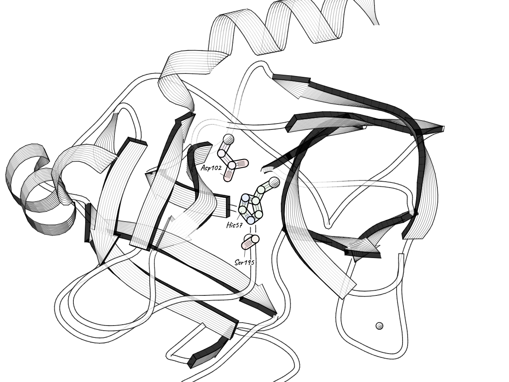
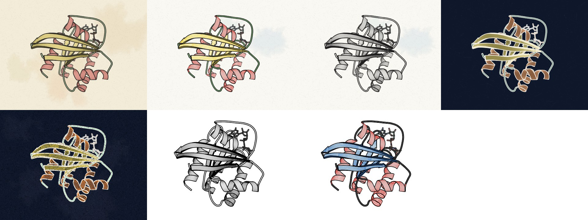
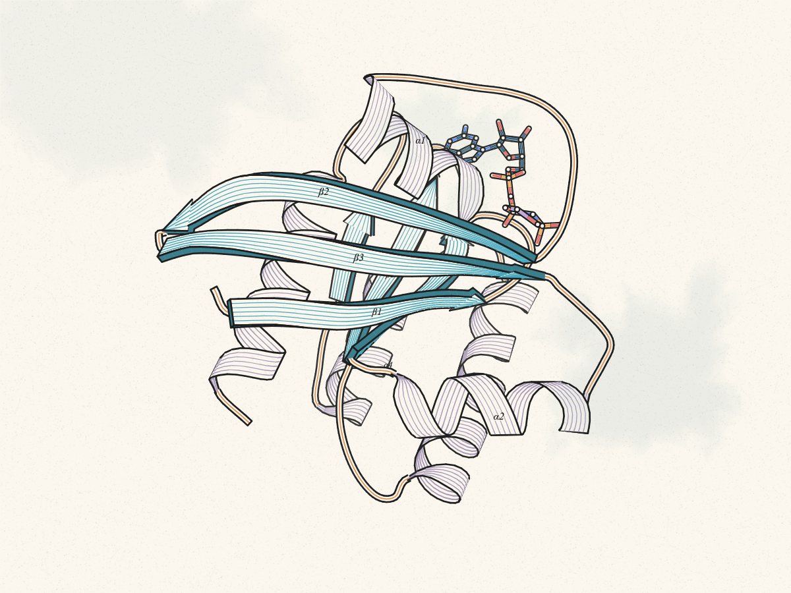
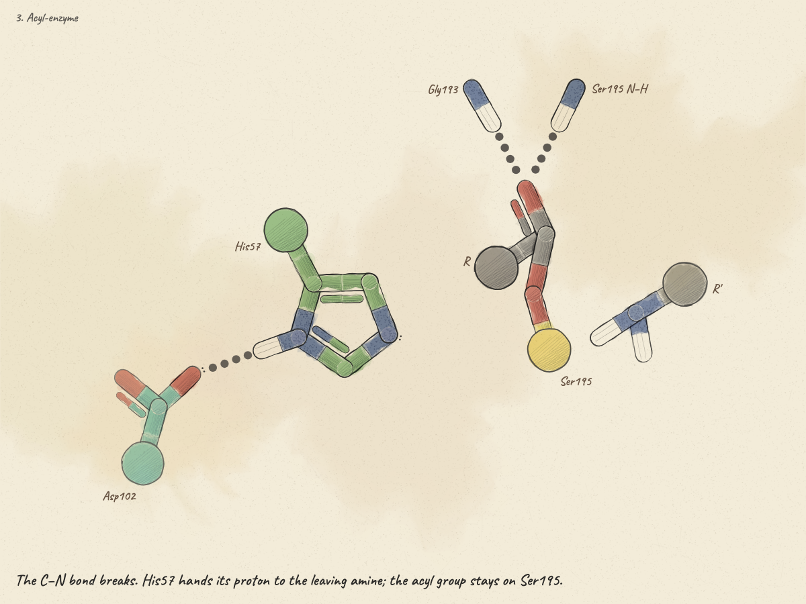
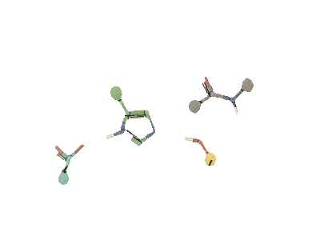
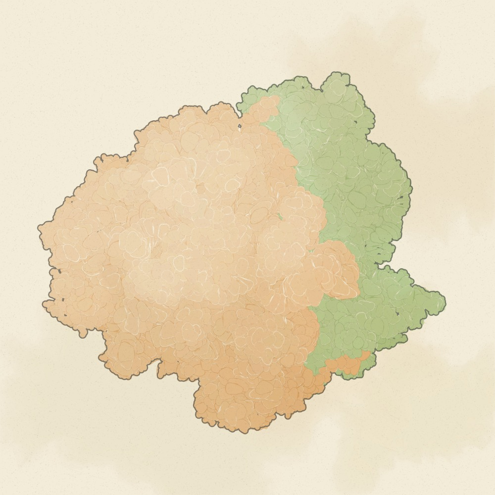
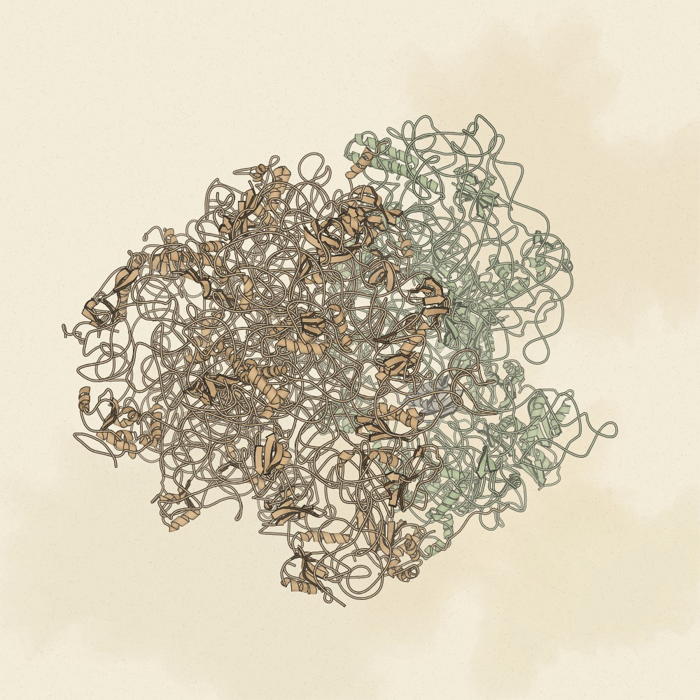

# Examples

Each script draws one figure and saves it in [`../docs/img`](../docs/img). Run them from the `python` folder of a
clone, for example `python examples/quickstart.py`. The structures are downloaded from the PDB the first time.

### [quickstart.py](quickstart.py): a protein, a pocket and a label

Ras (PDB 5P21) in engraved colour, with the nucleotide pocket marked by `site(ligand=True)` and a label pinned to
Tyr32.

### [active_site.py](active_site.py): an active site in its protein

Trypsin (PDB 2PTN). `site` marks the catalytic triad, `frame_site` turns it towards you, and `label_site` labels its
residues.

### [looks.py](looks.py): every look side by side

The same view in each look, rendered to NumPy arrays and joined into one image (needs Pillow). Shows `copy()` for
making variations of one figure.

### [custom_style.py](custom_style.py): changing the style yourself

Starts from the `ink-colour` look, then changes the palette, the pen, the hatching, the fog and the paper colour
with `palette` and `set`, and turns on the α/β labels.

### [mechanism.py](mechanism.py): a keyframed scene

A reaction mechanism saved from the app: one step as an image, and the whole loop as a GIF (the GIF needs
`ffmpeg`).

### [ribosome.py](ribosome.py): a large assembly

The 70S ribosome (PDB 6GZQ, about 144 000 atoms) as a watercolour surface and as a cartoon, coloured by subunit,
with the large subunit given a colour of its own through `color("subunit:L", …)`.

| surface | cartoon |
|---|---|
|  |  |
